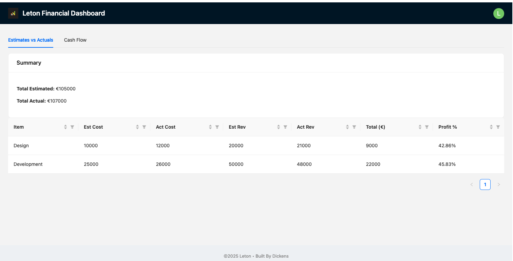
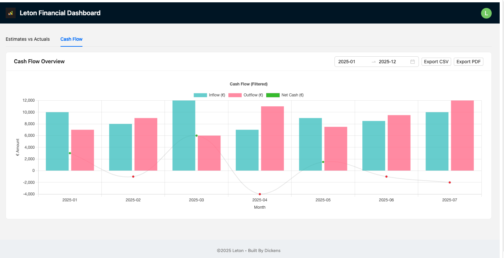

# Leton Financial Dashboard

This project is a technical test submission for Leton's IT Partner role. It provides a responsive dashboard that visualizes project financials, including **Estimates vs Actuals** and **Cash Flow projections**, built using **Vue 3**, **Vite**, and **Ant Design Vue**.

---

## Features

- **Estimates vs Actuals**
  - Compare estimated and actual costs/revenue
  - Dynamic profitability calculations (%)
  - Filter and sort by all columns

  

- **Cash Flow Visualization**
  - Inflow, outflow, and net cash graphed monthly
  - Liquidity risk indicators (color-coded)
  - Date range filtering
  - Export to CSV and PDF

  

---

## Tech Stack

- **Vue 3 + Vite** (frontend framework & dev tooling)
- **Ant Design Vue** (UI components)
- **Chart.js** (data visualization)
- **PapaParse** (CSV export)
- **jsPDF + html2canvas** (PDF export)
- **Day.js** (date parsing and formatting)

---

## Project Structure
```
leton-financial-dashboard/
├── src/
│   ├── views/ # Main dashboard view
│   ├── components/ # UI modules (Estimates, Chart)
│   ├── data/financialData.js # Mock data for demo
│   ├── App.vue # Main layout
│   └── main.js # App setup
```

---

## How to Run Locally

1. **Clone the repository**
   ```bash
   git clone https://github.com/your-username/leton-financial-dashboard.git
   cd leton-financial-dashboard
   ```

2. **Install dependencies**
   ```bash
   npm install
   ```

3. **Start development server**
   ```bash
   npm run dev
   ```
   Open your browser at http://localhost:5173

---

## How to Build for Production

```bash
npm run build
```
This will generate a `dist/` folder ready to deploy to any static host (Netlify, Vercel, etc.).

---

## Deployment Notes

To deploy on Netlify or Vercel:

- **Netlify**: Drag `dist/` folder to deploy manually, or connect to GitHub repo.
- **Vercel**: Connect repo and set framework to Vite.

---

## Assumptions Made

- Financial data is static/mock for demo purposes (e.g., `data/financialData.js`)
- The user is an internal project manager or finance analyst
- Currency is assumed to be in Euros (€) for consistency with sample data
- Time range defaults to Jan–Dec 2025 but is user-adjustable

---

## Author

**Dickens Juma**  
Nairobi, Kenya  
dickensjuma13@gmail.com
# Leton-Financial-Dashboard
